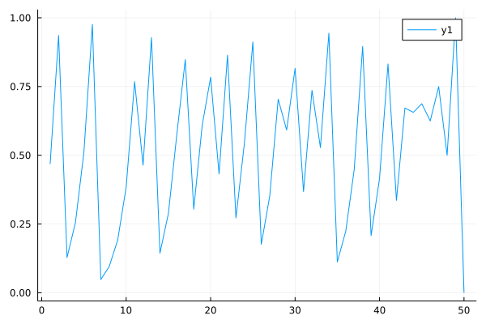
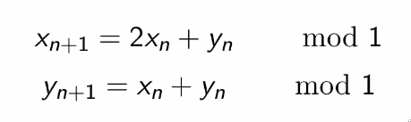
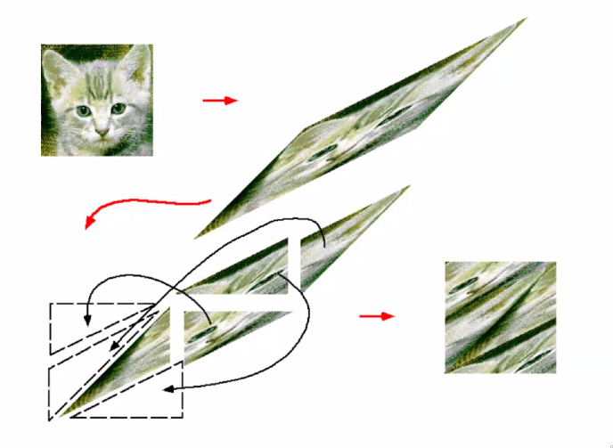

# 2022-01-07

## Chaos

Approximately close initial conditions do not give rise to approximately close final conditions.

There are systems of $N = 3$ which show chaos. We need atleast $N=3$.

## Chaotic Maps

Iterated maps. 

Consider a non invertable map $f$. An Iterated map orbit is defined as $I_n(x_0) = f^n(x_0)$.

### Tent Map

This is a peicewise linear map

$$f(x) = 1 - 2|x-\frac{1}{2}|$$

Thats is, 

$$\begin{cases}
2x & x < 1/2\\
2(1-x) & x>1/2
\end{cases}$$

<svg id="svg" viewbox="83.3499984741211,6.879999160766602,272,215.3300018310547" style="height:215.3300018310547"><line x1="111.02" y1="185.54" x2="109.35" y2="16.88" fill="none" stroke="#6190e8" stroke-width="2" d="M 111.02 185.54 L 109.35 16.88"></line><line x1="113.68" y1="186.21" x2="345.35" y2="179.54" fill="none" stroke="#6190e8" stroke-width="2" d="M 113.68 186.21 L 345.35 179.54"></line><line x1="115.02" y1="186.21" x2="214.68" y2="22.21" fill="none" stroke="#6190e8" stroke-width="2" d="M 115.02 186.21 L 214.68 22.21"></line><line x1="215.02" y1="22.21" x2="330.02" y2="178.88" fill="none" stroke="#6190e8" stroke-width="2" d="M 215.02 22.21 L 330.02 178.88"></line><line x1="227.68" y1="176.88" x2="231.35" y2="186.88" fill="none" stroke="#6190e8" stroke-width="2" d="M 227.68 176.88 L 231.35 186.88"></line><line x1="104.35" y1="18.21" x2="118.02" y2="20.21" fill="none" stroke="#6190e8" stroke-width="2" d="M 104.35 18.21 L 118.02 20.21"></line><path d="M 93.68,16.88 L 93.35,18.21 L 93.35,18.88 L 93.35,20.88 L 93.35,22.21 L 93.35,24.88 L 93.35,26.88 L 93.35,28.88 L 93.35,29.54 L 93.35,30.21" fill="none" stroke="#6190e8" stroke-width="2"></path><path d="M 222.35,195.54 L 222.02,196.21 L 222.02,196.88 L 222.02,198.21 L 222.02,200.21 L 222.02,202.88 L 222.02,203.54 L 222.02,204.88 L 222.02,204.88 L 222.02,205.54 L 222.02,207.54 L 224.02,210.21 L 224.68,210.21 L 226.68,210.21 L 227.35,210.21 L 229.35,210.21 L 230.02,210.21 L 230.02,208.88 L 230.68,206.88 L 232.02,206.21 L 232.02,204.88 L 232.02,204.21 L 232.02,203.54 L 232.02,202.88 L 232.02,202.21 L 232.02,201.54 L 231.35,200.88 L 230.02,200.88 L 229.35,200.88 L 228.68,200.88 L 227.35,200.88 L 226.02,200.88 L 225.35,200.88 L 225.35,201.54" fill="none" stroke="#6190e8" stroke-width="2"></path><path d="M 241.68,206.88" fill="none" stroke="#6190e8" stroke-width="2"></path><path d="M 241.02,205.54" fill="none" stroke="#6190e8" stroke-width="2"></path><path d="M 241.02,205.54" fill="none" stroke="#6190e8" stroke-width="2"></path><path d="M 230.93,202.88 L 230.93,202.21 L 230.93,202.21 L 230.93,202.21 L 230.26,202.21 L 230.26,202.21 L 229.59,202.21 L 228.93,201.54 L 227.59,201.54 L 226.26,200.88 L 224.93,200.88 L 222.93,200.88 L 220.93,201.54 L 219.59,203.54 L 218.93,204.88 L 219.59,208.21 L 220.93,209.54 L 222.93,211.54 L 226.26,212.21 L 230.26,212.21 L 233.59,210.88 L 236.26,209.54 L 238.26,208.21 L 239.59,206.88 L 239.59,206.21 L 238.93,204.88 L 236.93,202.21 L 234.93,200.21 L 232.26,198.21 L 230.26,197.54 L 228.26,198.21 L 226.26,198.88 L 224.26,200.21 L 222.93,201.54 L 221.59,202.88 L 220.93,203.54 L 221.59,205.54 L 222.26,206.21 L 225.59,206.88" fill="none" stroke="#6190e8" stroke-width="2"></path><path d="M 250.26,206.21 L 250.26,206.21 L 250.26,206.21 L 249.59,206.21 L 248.93,206.88 L 248.26,207.54 L 247.59,208.21 L 246.93,208.88 L 246.93,208.88 L 246.26,209.54 L 246.26,209.54 L 246.93,208.88 L 248.26,207.54" fill="none" stroke="#6190e8" stroke-width="2"></path><path d="M 252.93,200.88 L 252.93,200.88 L 252.93,200.21 L 252.93,199.54 L 252.93,198.88 L 252.26,197.54 L 252.26,197.54 L 251.59,198.21 L 250.93,198.88 L 250.26,199.54 L 250.26,200.88 L 250.93,201.54 L 252.26,202.21 L 254.26,202.21 L 256.93,202.88 L 258.93,202.88 L 260.26,203.54 L 260.93,203.54 L 261.59,204.21 L 261.59,204.88 L 260.26,205.54 L 258.93,206.21 L 257.59,206.21 L 256.26,206.21 L 254.93,205.54" fill="none" stroke="#6190e8" stroke-width="2"></path><path d="M 253.59,196.21 L 253.59,196.21 L 252.93,196.21 L 252.93,196.21 L 253.59,196.21 L 255.59,195.54 L 258.93,194.88 L 262.26,193.54 L 264.26,192.88 L 265.59,192.88 L 266.26,192.21 L 266.26,192.21 L 266.26,192.21" fill="none" stroke="#6190e8" stroke-width="2"></path></svg>  

For x < 0 or x > 1, the orbit is uncontained.

However, for 0 < x < 1, the orbit is bounded.

### Stretching and Folding

Stretching - Half the interval is stretched to the entire interval.

Folding - the Folding makes the orbit bounded.

## Cat Map

The map first stretches in the x direction, but it is cut and folded, put back into the box.

## Sensitivity on initial conditions

If $x_n$ = 0, 1/2, 1, then $x_{n+2} = 0$

If $x_n$ = 1/4, 3/4, then $x_{n+2} = 1$

Linear in between.

<svg id="svg" viewbox="26.93000030517578,22.209999084472656,391.33001708984375,203.32998657226562" style="height:203.32998657226562"><path d="M 102.93,33.21 L 102.93,32.88 L 102.93,33.54 L 102.93,33.54 L 102.26,33.54 L 102.26,33.54 L 102.26,34.21 L 102.93,34.88 L 102.93,37.54 L 102.93,40.21 L 103.59,47.54 L 103.59,51.54 L 104.26,58.21 L 104.93,63.54 L 106.26,70.88 L 106.93,76.21 L 108.26,85.54 L 108.26,90.21 L 108.93,96.88 L 109.59,102.21 L 110.26,110.21 L 110.93,116.88 L 111.59,120.88 L 112.93,126.21 L 112.93,130.88 L 113.59,134.88 L 113.59,137.54 L 114.26,141.54 L 114.26,144.21 L 114.26,146.88 L 114.26,148.88 L 114.26,150.88 L 114.26,152.88 L 113.59,154.88 L 113.59,156.21 L 113.59,157.54 L 113.59,157.54 L 113.59,158.88 L 113.59,160.21 L 113.59,162.21 L 112.93,164.21 L 112.93,164.88 L 112.93,165.54 L 112.93,166.21 L 112.93,166.21 L 112.93,166.88 L 112.93,166.88 L 112.26,163.54" fill="none" stroke="#6190e8" stroke-width="2"></path><path d="M 95.59,45.88 L 95.59,45.54 L 94.93,45.54 L 94.26,46.21 L 94.26,46.21 L 93.59,46.21 L 93.59,46.21 L 93.59,46.21 L 94.26,44.88 L 96.26,41.54 L 97.59,39.54 L 98.93,36.88 L 99.59,35.54 L 100.26,34.21 L 100.26,33.54 L 100.26,32.88 L 100.93,32.21 L 100.93,32.21 L 100.93,32.21 L 101.59,33.54 L 102.93,34.88 L 104.93,36.88 L 106.93,38.88 L 108.26,41.54 L 110.26,44.21" fill="none" stroke="#6190e8" stroke-width="2"></path><path d="M 113.59,176.54 L 113.59,176.21 L 113.59,176.21 L 112.93,176.21 L 112.93,176.88 L 114.26,177.54 L 115.59,178.21 L 120.93,178.88 L 125.59,178.88 L 130.93,179.54 L 138.93,179.54 L 148.26,178.88 L 156.26,178.21 L 168.26,176.88 L 180.26,176.88 L 192.93,176.88 L 202.26,176.88 L 214.93,176.88 L 224.93,176.21 L 236.93,174.88 L 248.26,174.21 L 257.59,172.88 L 264.26,172.88 L 273.59,171.54 L 279.59,170.88 L 286.93,170.88 L 292.26,170.88 L 300.93,170.88 L 305.59,170.88 L 314.26,170.21 L 320.26,170.21 L 326.93,169.54 L 332.93,169.54 L 337.59,169.54 L 340.93,169.54 L 347.59,170.21 L 352.93,170.21 L 359.59,170.88 L 365.59,170.88 L 371.59,171.54 L 376.93,171.54 L 382.93,172.21 L 386.93,172.21 L 390.93,172.21 L 394.26,172.21 L 398.93,172.88 L 402.26,172.88 L 405.59,172.88 L 406.93,172.88 L 408.26,172.88 L 408.26,172.88 L 407.59,171.54" fill="none" stroke="#6190e8" stroke-width="2"></path><path d="M 396.93,161.88 L 396.93,161.88 L 396.26,160.88 L 395.59,160.21 L 395.59,160.21 L 395.59,159.54 L 394.93,159.54 L 394.93,159.54 L 395.59,160.88 L 396.93,163.54 L 398.26,166.88 L 400.26,171.54 L 401.59,174.88 L 402.26,177.54 L 402.26,179.54 L 398.93,182.21 L 394.26,184.21 L 384.93,186.21" fill="none" stroke="#6190e8" stroke-width="2"></path><path d="M 280.93,204.54 L 280.93,203.88 L 280.93,202.88 L 280.93,202.21 L 280.93,201.54 L 280.93,200.88 L 281.59,200.88 L 282.93,201.54 L 284.93,202.88 L 287.59,206.21 L 289.59,208.21 L 291.59,208.88 L 291.59,208.21 L 292.26,206.88" fill="none" stroke="#6190e8" stroke-width="2"></path><path d="M 292.26,198.54 L 291.59,197.54 L 291.59,197.54 L 291.59,198.21 L 290.26,200.21 L 288.26,204.88 L 286.26,209.54 L 284.26,212.21 L 282.93,212.88 L 282.26,213.54 L 282.26,213.54" fill="none" stroke="#6190e8" stroke-width="2"></path><path d="M 304.26,207.21 L 304.26,207.21 L 303.59,206.21 L 303.59,206.21 L 302.93,206.21 L 302.93,205.54 L 302.93,205.54 L 302.93,205.54 L 302.26,207.54 L 302.26,209.54 L 302.93,211.54 L 302.93,212.21 L 302.93,213.54 L 302.93,213.54 L 303.59,212.88 L 304.26,211.54 L 304.93,209.54 L 305.59,207.54 L 306.93,206.21 L 307.59,205.54 L 308.93,205.54 L 310.26,207.54 L 312.26,210.88 L 313.59,212.88 L 314.93,214.88 L 314.93,215.54 L 316.26,213.54" fill="none" stroke="#6190e8" stroke-width="2"></path><path d="M 37.59,86.54 L 37.59,86.54 L 37.59,86.21 L 36.93,86.21 L 36.93,85.54 L 36.93,84.88 L 36.93,84.21 L 37.59,84.21 L 37.59,84.21 L 38.93,84.88 L 42.93,87.54 L 46.26,90.21 L 48.26,91.54 L 48.93,91.54 L 49.59,90.21" fill="none" stroke="#6190e8" stroke-width="2"></path><path d="M 47.59,78.54 L 47.59,78.54 L 46.93,77.54 L 46.93,77.54 L 46.26,78.21 L 44.93,80.88 L 42.93,86.21 L 41.59,89.54 L 40.26,93.54 L 39.59,94.88 L 39.59,96.88" fill="none" stroke="#6190e8" stroke-width="2"></path><path d="M 58.26,99.21 L 58.26,98.88 L 58.26,98.21 L 57.59,98.21 L 57.59,97.54 L 57.59,97.54 L 57.59,96.88 L 57.59,96.88 L 57.59,97.54 L 57.59,98.88 L 58.26,100.21 L 58.26,101.54 L 58.93,102.21 L 58.93,102.21 L 59.59,101.54 L 59.59,100.21 L 60.26,97.54 L 60.26,96.21 L 60.93,94.21 L 60.93,94.21 L 62.26,94.21 L 62.93,95.54 L 63.59,97.54 L 64.93,98.88 L 66.26,100.21 L 66.93,100.88" fill="none" stroke="#6190e8" stroke-width="2"></path><path d="M 69.59,91.88 L 69.59,91.54 L 68.93,90.88 L 68.93,90.21 L 68.93,90.21 L 68.93,90.21 L 69.59,90.88 L 70.93,92.21 L 71.59,93.54 L 72.26,95.54 L 72.93,96.88" fill="none" stroke="#6190e8" stroke-width="2"></path><path d="M 70.26,97.88 L 70.26,97.54 L 69.59,97.54 L 69.59,97.54 L 69.59,97.54 L 70.93,96.88 L 74.26,94.88" fill="none" stroke="#6190e8" stroke-width="2"></path><path d="M 77.59,87.88 L 77.59,87.54 L 76.93,87.54 L 76.93,87.54 L 76.93,86.88 L 77.59,86.21 L 78.93,84.88 L 80.93,83.54 L 81.59,83.54 L 82.26,83.54 L 82.26,84.21 L 82.26,86.21 L 82.26,87.54 L 82.26,89.54 L 82.26,91.54 L 82.26,92.21 L 83.59,92.88 L 85.59,92.21 L 87.59,91.54 L 88.93,90.88 L 90.26,90.21" fill="none" stroke="#6190e8" stroke-width="2"></path><path d="M 116.26,179.21 L 116.26,179.21 L 116.26,178.88 L 116.26,178.88 L 116.26,178.88 L 116.26,178.88 L 116.93,178.21 L 118.26,177.54 L 118.93,176.21 L 121.59,172.88 L 124.26,169.54 L 128.93,161.54 L 132.26,156.21 L 136.93,148.88 L 140.93,143.54 L 146.26,136.21 L 150.93,130.21 L 155.59,124.21 L 158.93,119.54 L 163.59,113.54 L 167.59,108.21 L 172.26,102.21 L 174.93,98.21 L 178.26,92.88 L 180.26,90.21 L 181.59,87.54 L 182.26,86.21 L 182.93,85.54 L 183.59,84.88 L 184.26,84.21 L 184.26,83.54 L 184.93,82.21 L 185.59,80.88 L 185.59,80.21 L 186.26,78.88 L 186.26,78.21 L 186.93,76.88 L 186.93,75.54 L 186.93,74.88 L 187.59,74.21 L 187.59,74.21 L 187.59,73.54 L 187.59,73.54 L 187.59,73.54 L 187.59,72.88 L 187.59,72.88 L 187.59,72.88 L 187.59,72.88 L 187.59,72.88 L 187.59,72.88 L 188.26,72.88 L 188.26,72.88 L 188.26,72.88 L 188.26,72.88 L 188.26,73.54 L 188.26,73.54 L 188.26,74.21 L 188.93,74.21 L 189.59,75.54 L 190.26,76.21 L 191.59,78.21 L 192.26,79.54 L 193.59,81.54 L 194.93,82.88 L 196.26,85.54 L 197.59,86.88 L 200.26,90.21 L 202.93,92.21 L 206.93,94.88 L 209.59,96.88 L 212.93,99.54 L 214.26,101.54 L 216.93,104.21 L 218.26,106.21 L 220.93,110.21 L 222.93,113.54 L 225.59,117.54 L 228.26,121.54 L 230.26,124.88 L 231.59,126.21 L 232.93,128.21 L 234.26,129.54 L 236.26,132.21 L 236.93,133.54 L 238.26,134.88 L 238.93,136.88 L 239.59,137.54 L 240.26,138.88 L 241.59,140.21 L 242.93,141.54 L 244.26,142.88 L 245.59,144.88 L 246.93,146.21 L 248.26,147.54 L 248.93,148.21 L 250.26,149.54 L 250.93,150.21 L 251.59,151.54 L 252.93,152.88 L 253.59,154.21 L 254.93,154.88 L 256.26,156.21 L 257.59,156.88 L 258.26,157.54 L 258.93,158.21 L 259.59,158.88 L 260.26,160.21 L 260.93,161.54 L 261.59,162.88 L 262.26,164.21 L 262.93,165.54 L 263.59,166.21 L 264.26,166.88 L 264.26,168.21 L 264.93,168.88 L 264.93,168.88 L 265.59,169.54 L 265.59,170.21 L 266.26,170.88 L 266.26,171.54 L 266.93,172.21 L 266.93,172.88 L 267.59,173.54 L 267.59,173.54 L 267.59,174.21 L 267.59,174.21 L 267.59,174.21 L 267.59,174.21" fill="none" stroke="#6190e8" stroke-width="2"></path><path d="M 273.59,175.21 L 273.59,174.88 L 272.93,174.88 L 272.93,175.54 L 272.26,175.54 L 272.26,175.54 L 271.59,176.21 L 271.59,176.21 L 271.59,176.21 L 271.59,176.21 L 271.59,176.21 L 271.59,176.21 L 271.59,175.54 L 272.93,174.21 L 273.59,172.21 L 275.59,168.88 L 276.93,164.88 L 278.93,158.88 L 280.93,154.21 L 284.26,146.88 L 286.93,142.88 L 290.93,137.54 L 294.26,132.88 L 296.93,130.21 L 299.59,127.54 L 300.93,126.21 L 303.59,123.54 L 305.59,120.88 L 306.93,119.54 L 308.26,118.88 L 308.93,116.88 L 310.26,114.88 L 312.93,112.21 L 314.93,109.54 L 316.26,107.54 L 316.93,106.21 L 317.59,104.21 L 319.59,101.54 L 320.26,99.54 L 321.59,97.54 L 322.26,95.54 L 322.93,93.54 L 323.59,92.21 L 324.26,89.54 L 324.93,88.88 L 325.59,86.88 L 326.26,86.21 L 326.93,85.54 L 326.93,84.88 L 327.59,84.21 L 328.26,82.88 L 328.93,81.54 L 329.59,80.88 L 330.26,80.21 L 330.26,79.54 L 330.93,78.88 L 330.93,78.88 L 330.93,78.21 L 330.93,78.21 L 331.59,77.54 L 331.59,77.54 L 331.59,76.88 L 331.59,76.88 L 332.26,76.88 L 332.26,76.21 L 332.26,76.21 L 332.26,76.21 L 332.26,76.21 L 332.26,76.21 L 332.26,75.54 L 332.26,75.54 L 332.26,75.54 L 332.26,74.88 L 332.93,74.88 L 332.93,74.21 L 332.93,73.54 L 332.93,72.88 L 332.93,72.21 L 333.59,72.21 L 333.59,71.54 L 333.59,70.88 L 334.26,70.88 L 334.26,70.21 L 334.26,70.21 L 334.26,70.21 L 334.93,69.54 L 334.93,69.54 L 334.93,69.54 L 335.59,68.88 L 335.59,68.88 L 335.59,68.21 L 336.26,68.21 L 336.26,68.21 L 336.26,67.54 L 336.93,67.54 L 336.93,67.54 L 336.93,66.88 L 336.93,66.88 L 336.93,66.88 L 336.93,66.88 L 336.93,67.54 L 337.59,68.88 L 337.59,70.21 L 338.26,71.54 L 338.93,74.21 L 340.26,78.21 L 342.26,82.88 L 343.59,86.21 L 346.26,90.21 L 348.26,93.54 L 350.26,96.21 L 351.59,97.54 L 352.93,98.88 L 354.26,100.21 L 354.93,100.88 L 355.59,102.21 L 356.26,103.54 L 358.26,106.21 L 360.26,107.54 L 362.26,110.21 L 363.59,111.54 L 364.93,113.54 L 365.59,114.88 L 366.93,117.54 L 367.59,118.88 L 368.93,121.54 L 370.26,123.54 L 371.59,125.54 L 372.93,127.54 L 373.59,128.88 L 374.26,130.88 L 374.93,132.21 L 375.59,133.54 L 376.26,134.88 L 376.93,136.88 L 377.59,138.21 L 378.93,140.21 L 379.59,140.88 L 380.26,142.88 L 380.93,144.21 L 381.59,145.54 L 382.26,147.54 L 383.59,148.88 L 384.26,150.21 L 384.93,151.54 L 385.59,152.88 L 386.26,153.54 L 386.26,154.21 L 386.93,155.54 L 387.59,156.88 L 388.26,158.21 L 389.59,159.54 L 390.26,161.54 L 390.93,162.88 L 392.26,164.21 L 392.93,165.54 L 394.93,166.88 L 395.59,168.21 L 397.59,170.21 L 398.26,170.88 L 399.59,172.21 L 400.26,172.21 L 400.93,172.88 L 400.93,173.54 L 401.59,174.21 L 401.59,174.88 L 402.26,174.88 L 402.26,175.54 L 402.93,175.54 L 402.93,176.21 L 402.93,176.21 L 403.59,176.88 L 403.59,176.88 L 402.93,176.88 L 402.26,176.88" fill="none" stroke="#6190e8" stroke-width="2"></path></svg>  

Hence, m iteration gives m tents.

If $\epsilon_0 = 1/2^m$ then $x_m$ can be anywhere between [0, 1]