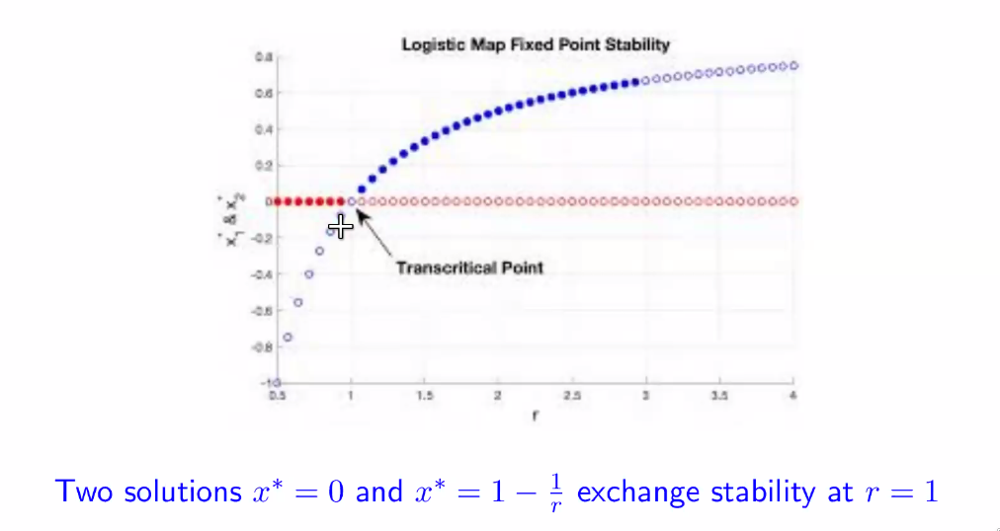

# Tuesday, January 25, 2022

## Transcritical Bifurcation

- Two solutions exchange stability
  

At $r = 3$, Period 1 cycle becomes unstable, and at the same time Period 2 cycle comes into being.

$r_i$ is the value of the parameter $r$ when Period $2^i$ crosses to $2^{i+1}$

$r_0=3$

$r_1 = 3.449$

$r_2 = 3.45$

Infinite cascade of period doublings keeps narrowing, and $r_{\infty} \approx 3.57$.

## Solving for the Period 2 cycle

We need to solve the Degree 4 equation of $F^2(x) = x$. However, we know 2 of the solutions which can be factored out and the quadratic equation can always be solved.

On solving,

$$x^*_{2_\pm} = \frac{r \pm \sqrt{(r-3)(r+1)}}{2r}$$

These are real only for $r>3$. So 2 cycle exists for all $r>3$. 2 cycle does not exist for $r<3$.

### Stability  of the 2 cycle

Trivially,

1. at $x^*=0$, $\lambda = r^2$. Hence, it is always unstable.
2. Similarly, we can evaluate for $x^* = 1- 1/r$

For the 2 cycle, $\lambda_2 = F^\prime(x_1)F^\prime(x_2)$. To analyse the stability, reduce the question of stability of a fixed point. Both are solutions of $F^2 = I$. We can use the above solutions to get $\lambda_2 = 4+2r-r^2$. Hence, $3<r<1+\sqrt{6}$ is where the 2 cycle is stable.