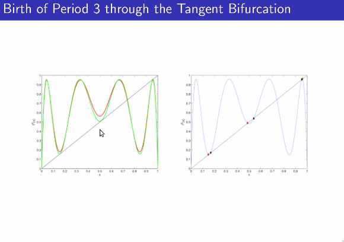
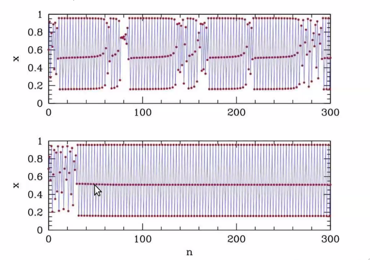

# Tuesday, February 1, 2022

## Universality of Figenbaum

$x_{n+1} = \sin(x_n)$

## Superstable orbit ratio

$R_i$ is a superstable fixed point of a period $2^{i}$ orbit.

Let $\delta_m$ be the distance between $y=1/2$ and nearest other $2^m-1$ points in the cycle - which happens to be  point where one half period displaced from the critical point

$\delta = F^{2^{m-1}}$

$\frac{\delta_m}{\delta_{m+1}} \to -2.50280 \equiv\alpha$

## What happens beyond $r_\infty$?

- Chaotic bands - 
- Windows of odd periods - third kind of [[2022-01-18#Bifurcations\|bifurcation]]

### Tangent Bifurcation

No solutions $\to$ 2 new solutions, 1 stable, 1 unstable.

Tangent points form new solutions, which may give 1 stable and 1 unstable points. If the number of tangents is odd, then we have an odd number of points

### Intermittency

Where close to the period 3 cycles, the time series has laminar(almost 3 cycle) sections interrupted by turbulent flows. The closer we get to actual 3 cycle, the longer the laminar sections get larger and larger.

[//begin]: # "Autogenerated link references for markdown compatibility"
[2022-01-18#Bifurcations|bifurcation]: 2022-01-18 "Tuesday, January 18, 2022"
[//end]: # "Autogenerated link references"