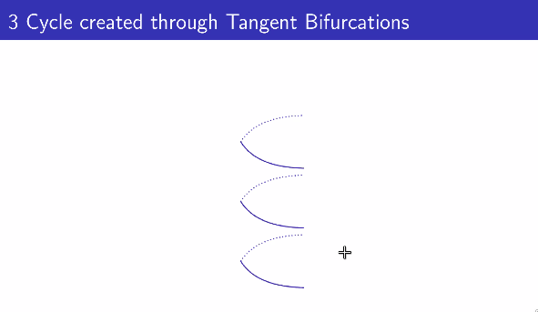

# Wednesday, February 2, 2022

## Mechanisms to get an odd period

Third kind of [[2022-01-18#Bifurcations\|bifurcation]] - Tangent Bifurcation, Saddle node bifurcation

No solutions $\to$ 2 solutions, of which 1 is stable and 2 are unstable.

## Intermittency

[[2022-02-02#Intermittency\|Intermittency last class]]

## Structure within this region

- [[2022-01-27#Figenbaum scaling]] is still retained.
- Period doubling also occurs

## Organisation and Appearance of Periodic Orbits

$3, 5, 7, ...$
$2\*3, 2\*5, 2\*7, ...$
$2^2\*3, 2^2\*5, ...$
$...$
$...2^3, 2^2, 2^1, 1$

Orbits of a map $F$ will come in the reverse order. Hence, Period 3 implies chaos.

[//begin]: # "Autogenerated link references for markdown compatibility"
[2022-01-18#Bifurcations|bifurcation]: 2022-01-18#bifurcations "bifurcation"
[2022-02-02#Intermittency|Intermittency last class]: 2022-02-02#intermittency "Intermittency last class"
[2022-01-27#Figenbaum scaling]: 2022-01-27 "Thursday, January 27, 2022"
[//end]: # "Autogenerated link references"