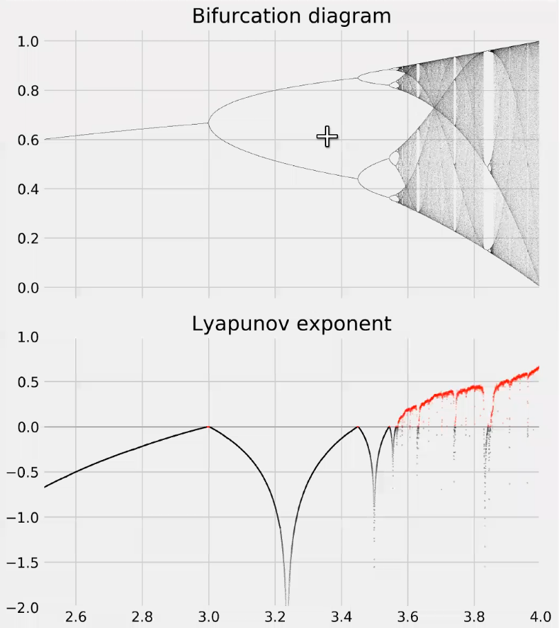

# Monday, February 08, 2022

# Quantitative Classification of Chaos

We define the Lyaponov exponent $\lambda$ as 

$$|\delta_n| = |\delta_0|e^{\lambda n}$$

Noting that 

$$|\delta_n| = F^n(x+\delta) -F^n(\delta)$$

Hence, 

$$\lambda = \frac{1}{n}\ln\frac{F^n(x+\delta x) -F^n(x)}{\delta_0} = \frac{1}{n}ln |(F^n)'(x)|$$

And using Chain rule,

$$|(F^n)'| = \prod_{i=1}^n |F'(x_i)|$$

Here, we have shifted the derivative of the nth iterate to the product of derivatives over the trajectory.

Finally, 

$$\lambda = \lim_{n\to \infty} \frac{1}{n}\sum_{i=1}^n \ln|F'(x_i)|$$

Clearly, 

$\lambda$ depends on $x_0$, but for a particular basin of attraction, it is same. This is because all points in this basin finally reach the same orbit, and in large n limit, the transince period does not matter.

## Values and Classification

### Stability

$\lambda < 0$ is stable points and $\lambda > 0$ is Chaotic.

$\lambda = \ln 0 = -\infty$ is super stable.

## Lyaponov for some maps

For the tent map, $\lambda = \ln 2$

For logistic map however, the $\lambda$ depends on $x$

$$\lambda = \frac{1}{n}\prod_i^n \ln(|r-2rx|)$$

# Renormalization

1. Let $f(x, r)$ be an unimodal  which goes through period doubling to chaos
2. $x_m$  is the maximum of $f(x, r)$$
3. $r_n$ is where $2^n$ cycle bifurcation
4. $R_n$ is super stable cycle of period $2^n$

## Example

For example, 

$f(x, r) = r - x^2$

###  $R_0,\ R_1$

$R_0$ must also be a period 1 cycle.

$x^* = R_0 - x^{*2}$

$f'(x^*, R_0) = 0$

Hence, $x^* = 0$, and hence, 

$$R_0 = 0$$

$R_1$ must be cycle 2, and super stable at two points.

Let $x_1$ and $x_2$ be the cycle, 

$F'(x_1)*F'(x_2) = 0 \implies 4x_1x_2 = 0$, and hence, wlog $x_1 = 0$

Now, from the period 2 condition, 

$F^2(0, r) = r - r^2 = 0\implies r = 0$ or $r=1$. But $R_0=0$, and hence, $R_1=1$

