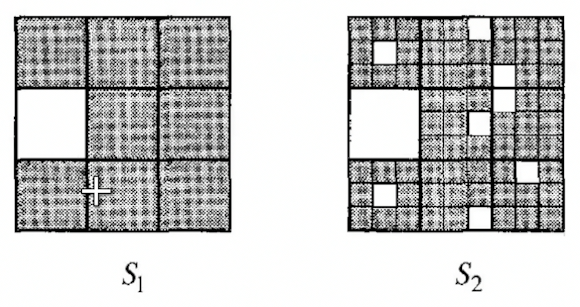

# Fractals

- Complex geometric shapes with fine structure at arbitrarily small scales.
- Self similarity
  - Generally upto some scale
  - Generally statitstical similarity
- Strange attractor
  - Have geometrical properties which are self similar

# Countable and Uncountable sets

Any set that is bijective with $\mathcal{N}$ is called countable.

Consider $\mathcal{E} = \{\text{even numbers}\}$ which can be written as 

$$\mathcal{E} = {2n \| n\in \mathcal{N}}$$

But $\mathcal{R}$ is uncountable can be shown by contradiction.
Let $[r_i]$ be the binary expansion of every $r$ in $\mathcal{R}$.
Assume that $\mathcal{R}$ is countable, therefore all $r$ can be indexed by some variable $j$.

Now consider $x$ which has a binary expansion where $x_j = ~r_{j}^j$. This $x$ is different from every $r^j$ at the $j$th position, which is a contradiction.

# Fractal Sets - Cantor set

Consider a line from $l_0 = [0, 1]$. Generate $l_1$ by removing $[1/3, 2/3]$. Generate $l_2$ by removing the middle third of each segment. Then, the Cantor set is defined as all the points in $l_\infty$

## What is the measure of this Cantor set?

Any $l_i$ must be smaller than $l_j$ for all $j<i$. Hence, $l_\infty$ must be smaller than all $l_i$. 

Now $l_i$ has a length of $(2/3)^n$. Hence, taking $\lim_{n\to\infty}$ gives a length for $l_\infty = 0$

## How many points in the set?

Consider the ternery expansion of any $r$ in $[0, 1]$. It is of the form $r = \sum r_i (1/3)^i$ where $r\in \{0, 1, 2\}$. Geometrically, $r$ lies in the $r_ith$ third in the $r_{i-1}th$ segment.
Hence, the Cantor set is the set of all points which don't exist in the second third in any segment. This implies that they don't have a $1$ in their ternary expansion.
Now to show that the Set is uncountable, we again assume that it is countable, and generate an $x$ such that $x_i = 2 - r^j_j$ which will not be a part of the set, exactly like in [[#Countable and Uncountable sets\|Real numbers]]

> Hence, the Cantor set has uncountably many points but still has a measure of 0

# Dimensions of Fractals

## Similarity dimension

This is given by looking at how many more scaled self similar parts we need to make every part of the fractals.

If $m$ is the number of scaled, and r is the scaling parameter, then the similarity dimension is given by 

$$d_s = \frac{\ln m}{\ln n}$$

For example, a box can be covered by $r^3$ boxes scaled by r boxes.

For the Koch curve, we need 4 lines of size 1/3 to cover each step of the Koch sequence. Hence, the dimension is $\ln4/\ln3)$

For the Cantor set, we need 2 lines of size 1/3 to cover each $l_n$. Hence, $d_{s} = \ln2/\ln3$

## Statistical Fractals

This are fractals where self similarity is only statitstical and not exact.

In such cases, we cannot define the Similarity dimension, and we need to introduce other 

## Box Dimension

It is the number of boxes of size $\epsilon$ needed to cover the set as $\epsilon$ tends to 0.

$$d_b = \lim_{\epsilon\to 0} \frac{\ln N(\epsilon)}{\ln\frac{1}{\epsilon}}$$

For the Koch curve, we take $\epsilon = 1/3^n$. We need $4^n$ such segments. Hence, taking $\lim_{n\to\infty}$, we get $d_b = \frac{\ln(4^n)}{\ln(\frac{1}{1/3^n})}=\frac{\ln 4}{\ln 3}$

For the Cantor set, we take $\epsilon = 1/3^n$. We need $2^n$ such segments. Hence, taking $\lim_{n\to\infty}$, we get $d_b = \frac{\ln(2^n)}{\ln(\frac{1}{1/3^n})}=\frac{\ln 2}{\ln 3}$

For the 8/9 statitstical Fractal, the box dimension can be found by $\epsilon = 1/3^n$, and $N = 8^n$. Hence we get $d_b = \frac{\ln8}{\ln3}$

## Point Dimension

For dynamical maps, we cannot define such a dimension.

One way to define the dimension is to take the average density of an orbit at each point. Hence, the box dimension weighs each box equally, whereas the point/correlation dimension weighs each point by density.

$d_\text{corr} \le d_b$

$$d_{correlation} = \frac{\ln C(\epsilon)}{\ln \epsilon}$$

This $C(\epsilon)-\epsilon$ curve generally saturates at very small $\epsilon$ and very large $\epsilon$. For large $\epsilon$, the ball is so big that it engulfs the entire orbit. For small $\epsilon$, the sample size is not large enough, which leads to no points being recorded.

[//begin]: # "Autogenerated link references for markdown compatibility"
[#Countable and Uncountable sets|Real numbers]: #countable-and-uncountable-sets "Real numbers"
[//end]: # "Autogenerated link references"