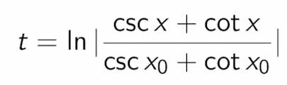
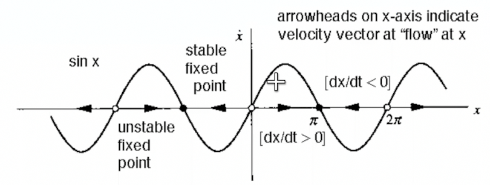
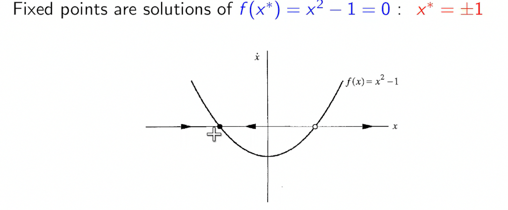
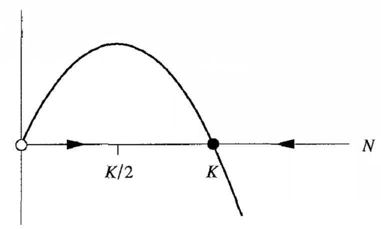
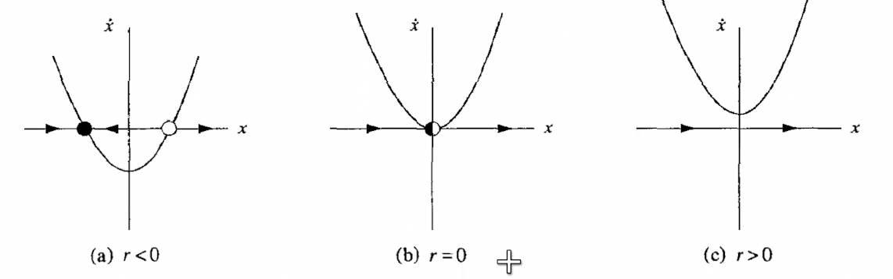
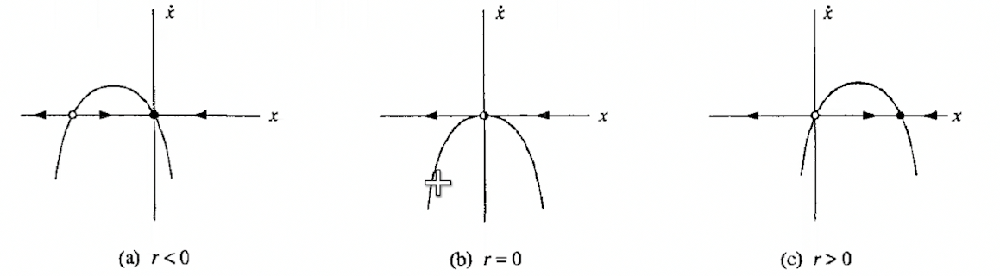
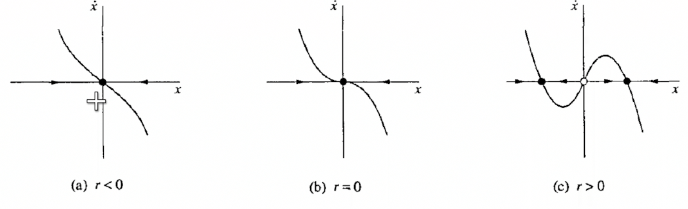
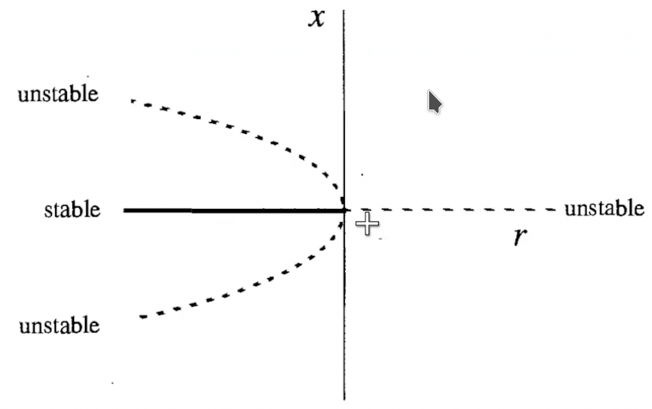

# One Dimensional Maps

$$\left\{\frac{dx_i}{dt} = f_i([x_j])\right\}$$

In the simplest case, 

$\frac{dx}{dt} = f(x)$

where $f$ has no explicit time dependance.

Consider $f(x) = sin(x)$. For this, the solution fo the diff eq is 

Which is a pain to evaluate, and does not give much insight.

## Vector Fields

We can also represent the differential equation to be a vector field, which tells us the velocity vector on a line.

1. the sign of $\dot x$ tells us which direction the flow is
2. When $\dot x$ is 0, it is a fixed point $x^\*$.
3. Both of the above tell us which points are stable. They are those where $\dot x$ is decreasing at $x^\*$

## Linear stability analysis

Define

$\eta(n) = x(t) - x^\*$ as a perturbation around $x^\*$

Then, $\dot \eta = f(x) - 0$

But, $f(x) = f(x^\* + \eta) = f(x^\*) + \eta f'(x^\*) + \mathcal{O}(\eta^2)$

But $f(x^\*) = 0$, and $f(x) = \dot \eta$

Hence,

$$\dot \eta = \eta f'(x^\*)$$

Which has a solution

$\eta = \eta_0 \exp(f'(x^\*) t)$.

### Stability

Hence the fixed point is 

$\begin{cases}
    \text{Stable} & f'(x^*) < 0 \\
    \text{Unstable}&f'(x^*) > 0 \\
    \text{Non linear analysis necessary}&f'(x^*)=0
\end{cases}$

### Characteristic Time Scale

$\tau = \frac{1}{\vert f'(x^\*)\vert}$

## Population Growth

$$\frac{dN}{dt}=rN(1 - N/k)$$

Fixed points are $N = 0$ (unstable) and $N = k$ (stable)

The flow accelerates from $0$ till $K/2$, then decelerates till $K$ and then stops.

## RC Circuit

$$\dot Q = \frac{V_0}{R} - \frac{Q}{RC}$$

$Q^\*= V_0C$

## Existance of solutions in time

Consider $\dot x = x^2 + 1$. With $x(0) = 0$, the solution is $x = tan(t)$ which exists only in $t\in(-\pi/2, \pi/2)$.

Therefore, the system blows up to infinity in finite time.

## Impossibility of Oscillations

For a vector field on a line,

1. Trajectories can either increase, decrease, or remain constant
2. Hence, no periodic solutions to $\dot x = f(x)$
3. Fixed points are either attractors or repellors
   
### Mechanical Analogue - Over damped systems

$$m\ddot x  = F(x) - b\dot x$$

If $b\dot x\gg m\ddot x$, 

$$\dot x = F(x)/b$$

which is a flow on a single line.

## $F(x)$ as a "Potential"

As in previous section, $f(x)$ can be considered as a "force" on a particle, but the particle is highly damped (think: in a highly viscous fluid).

Hence, plotting $F(x)$ tells us a "mountain" to ascend or descend.

# Bifurcations

While the maps are simple, We can still get bifurcations by varying some parameter.

Bifurcations can either be points where

- Fixed points created/destroyed
- Fixed points exchange stability

See [[2022-01-18#Bifurcations]] for more.

## Tangent Bifurcation

Consider 

$$\dot x = x^2 + r$$

Here, we see a saddlenode bifurcation, or tangent bifurcation at $r = 0$

This is very similar to [[2022-02-01#Tangent Bifurcation]].

### A more complicated Example

$$\dot x = r - x - e^{-x}$$

The trick is to plot $r-x$ and $e^{-x}$, and to see for what value of $r$ it intersects.

Since intersection must be tangential,  $\frac{d(r_c-x)}{dx} = \frac{d e^{-x}}{dx}$ at point of intersection $x^\*$

Hence, $e^{x^\*} = 1$ is the point of intersection. That is, $x^\* = 0$.

But also, $r_c-x^\* = e^{-x^\*}$, which implies $r_c = 1$

## Normal forms

For tangent bifurcations, $f(x, r)$ generally looks like $r \pm x^2$. This comes from the taylor expansion and that $f = 0$ and $f' = 0$ at $(x^\*, r_c)$.

## Transcritical Bifurcations

Now consider a Normal form of type

$$f(x) = rx - x^2 = x(r-x)$$

In this case, the $\dot x$ vs $x$ plot moves horizontally and vertically.

- $x^\* = 0$ is always a fixed point.
- the other point is $x^\* = r$

From linear stability analysis,

$f'(x, r) = r - 2x$ implies 
1. $x^\* = 0$ is stable when $r<0$ and unstable otherwise
2. $x^\* = r$ is stable when $-r<0\implies r>0$ and unstable otherwise

To get to a normal mode, we can take taylor expansion of $f$ and then make a change of variable to bring it to the form $\dot x = rx-x^2$. From there, $r=0$ is the point of transcritical bifurcation, as $x^\*=0$ is **always** a solution.

## Supercritical Pitchfork bifurcations

The normal mode is of the form 

$$\dot x = rx-x^3$$

1. Fixed points are $0, \pm \sqrt{r}$. Hence, only one fixed point for $r<0$
2. From linear stability, $0$ is stable for $r<0$ and unstable after. $\pm\sqrt{r}$ is stable for $r>0$

### Critical Slowing down

However, at $r=0$, linearity vanishes, but $x^\* = 0$ is still weakly stable, in that perturbations do not decay exponentially fast, but only algebraically fast. This is known as Critical Slowing down

These are also called second order phase transitions.

## Subcritical Pitchfork bifurcation

$$\dot x = rx+x^3$$

However, this is rare in physical systems and there's not much to see in this system. Hence, we add a -ve term

$$\dot x = rx + x^3 -x^5$$

gives a saddlenode bifurcation for $\vert x^\*\vert \gg 0$

[//begin]: # "Autogenerated link references for markdown compatibility"
[2022-01-18#Bifurcations]: 2022-01-18#bifurcations "2022-01-18#Bifurcations"
[2022-02-01#Tangent Bifurcation]: 2022-02-01#tangent-bifurcation "2022-02-01#Tangent Bifurcation"
[//end]: # "Autogenerated link references"